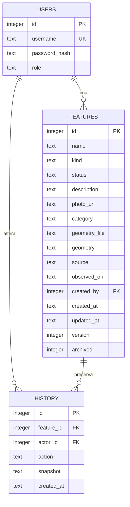

# Modelo de dados e API

Atualização Figma: campos adicionais `photo_url` (link HTTPS), `category` (classificação de uso opcional) e `geometry_file` (nome do arquivo importado). Bancos existentes recebem migração aditiva com backup antes da mudança.

## Modelo implementado



`users`: conta de acesso e perfil. Senhas são hashes produzidos por Werkzeug; não há conta padrão. Gestão de contas por CLI.

`features`: trilhas e nascentes em uma entidade comum. `geometry` armazena GeoJSON validado: `Point` para nascente e `LineString`/`MultiLineString` para trilha. Segmentos desconectados permanecem separados. Coordenadas sempre em longitude, latitude, WGS84. `source` identifica a origem do levantamento; `observed_on` guarda sua data. Horários de criação e atualização são UTC. `version` impede sobrescrita por edição desatualizada. `archived` retira o item da consulta corrente sem destruir dados. A serialização inclui `length_m`, calculado por distância geodésica aproximada para trilhas e nulo para nascentes.

`history`: snapshot completo depois de cada criação, edição e arquivamento, com autor e horário UTC. Alteração e histórico são gravados na mesma transação. Não existem observações de campo independentes ou tabela de fotos nesta versão.

Integridade: chaves estrangeiras, unicidade de usuário, enumerações via CHECK e índice em tipo/situação/arquivamento. O esquema é idempotente para a primeira versão, mas não é um sistema de migrações. Mudanças futuras exigem migrações e cópia de segurança.

## Endpoints

| Método e caminho | Uso | Acesso |
| --- | --- | --- |
| GET `/health` | Saúde básica da aplicação; não verifica o banco | Público |
| POST `/api/login` | Inicia sessão, retorna usuário, perfil e token CSRF | Credenciais |
| GET `/api/session` | Consulta a sessão atual | Autenticado |
| POST `/api/logout` | Encerra sessão | Autenticado + CSRF |
| GET `/api/features` | Lista registros ativos | Autenticado |
| POST `/api/features` | Cria registro | Gestor/editor + CSRF |
| PUT `/api/features/{id}` | Edita com controle de versão | Gestor/editor + CSRF |
| POST `/api/features/{id}/archive` | Arquiva com controle de versão | Gestor + CSRF |
| DELETE `/api/features/{id}` | Exclui permanentemente registro e histórico, com versão | Gestor + CSRF |
| POST `/api/import-geometry` | Converte arquivo multipart GPX/KML em geometria, sem cadastrar | Gestor/editor + CSRF |
| GET `/api/features/{id}/history` | Histórico inclusive de item arquivado | Autenticado |
| GET `/api/geojson` | Exporta FeatureCollection | Autenticado |

Lista e exportação aceitam `q`, `kind` e `status`. O filtro de texto usa LIKE sobre nome e descrição; a busca não normaliza acentos. Enviar o token retornado na sessão em `X-CSRF-Token` nas mutações autenticadas. O cookie de sessão usa HttpOnly e SameSite=Lax.

Exemplo de criação de nascente **fictícia para teste**:

```json
{
  "name": "Nascente de demonstração",
  "kind": "nascente",
  "description": "Registro fictício, não representa levantamento real",
  "status": "a_verificar",
  "source": "Demonstração acadêmica",
  "observed_on": "2026-01-01",
  "geometry": {"type": "Point", "coordinates": [-46.30, -23.77]}
}
```

Edição recebe os mesmos campos e `version` da listagem. Arquivamento recebe `{"version":1}`. Autoria e horário são definidos pelo servidor. Situações permitidas: `a_verificar`, `conservado`, `atencao`.

Respostas: 200 consulta/edição/importação; 201 criação; 204 logout/arquivamento/exclusão; 400 dados inválidos; 401 sem autenticação; 403 sem perfil ou CSRF; 404 item ausente; 409 versão desatualizada; 413 payload acima do limite. Requisições de criação/edição: 8 MiB; importação multipart: 16 MiB, com arquivo limitado a 15 MiB; demais endpoints: 256 KiB. A importação recebe campos `file` e `kind` e retorna geometria, nome sanitizado do arquivo e extensão aproximada. O XML não é guardado. Há limite de 100.000 pontos por registro.

## Evolução prevista

Fotos: o Figma utiliza link para pasta externa, implementado em `photo_url`. Uma futura opção de upload exigirá MIME validado, autoria e armazenamento persistente; não está definida pelas imagens atuais.

PostgreSQL/PostGIS: geometria nativa com SRID 4326, índice espacial e migrações. Não substituir SQLite na configuração sem implementar adaptador e migração.
