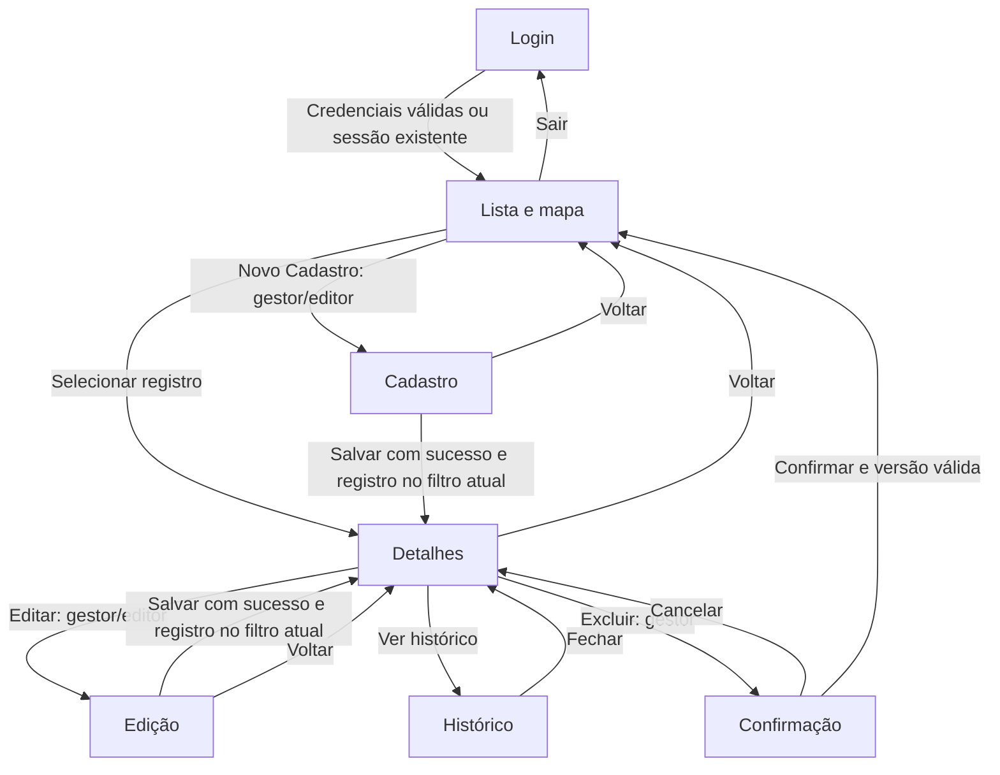

# Especificação funcional reversa — Inventário Digital REBIO ASP

**Versão documental:** 1.0  
**Data:** 03/10/2026  
**Sistema:** Inventário Digital da REBIO do Alto da Serra de Paranapiacaba  
**Método:** engenharia reversa do código, esquema de dados, interface e testes da versão local.

## 1. Finalidade e escopo

O sistema permite à equipe autorizada manter um inventário georreferenciado de trilhas e nascentes. As funções centrais são cadastrar, consultar, visualizar, editar, exportar e excluir registros, com identificação da origem do levantamento e histórico de alterações.

Este documento descreve o comportamento implementado, incluindo suas restrições. Os identificadores RF, RN e UC são criados nesta especificação e não reproduzem a numeração do documento original do grupo. A implementação ainda precisa ser conciliada com os RF/RNF originais e homologada pela REBIO.

### 1.1 Fontes de extração

| Fonte | Evidência utilizada |
| --- | --- |
| `inventario/__init__.py` | Autenticação, autorização, API, validação de campos, transações, migração e comandos administrativos. |
| `inventario/geography.py` | Geometrias aceitas, importação GPX/KML e cálculo de extensão. |
| `inventario/schema.sql` | Entidades, relacionamentos, valores permitidos e campos persistidos. |
| `inventario/templates/index.html` | Telas, campos, botões, diálogos e conteúdo semântico. |
| `inventario/static/app.js` | Navegação, preenchimento, filtros, mapa, importação e interação com a API. |
| `inventario/static/style.css` | Disposição desktop, adaptação móvel e indicação de foco. |
| `tests/test_app.py` e `tests/test_geography.py` | Verificações automatizadas de comportamentos e restrições. |
| `tools/verify_figma_ui.cjs` e `docs/VALIDACAO.md` | Fluxos de navegador e resultados registrados anteriormente. |
| Seis imagens locais do Figma | Referência visual incorporada à implementação; não substituem o código como fonte do comportamento atual. |

Não foi necessária consulta ao banco com dados reais para esta extração. A atividade documenta o sistema e não modifica suas regras ou registros.

### 1.2 Fora do escopo implementado

Levantamento físico do território, controle de visitantes, autorização de pesquisas, envio de fotos ao servidor, desenho de geometria pelo mapa, análise temporal independente, delimitação oficial da reserva, operação offline completa e administração de contas pela interface web.

## 2. Atores e permissões

**Gestor:** usuário autenticado com consulta, criação, edição, importação e exclusão permanente. Também pode arquivar pela API.

**Editor:** usuário autenticado com consulta, criação, edição e importação, sem exclusão permanente ou arquivamento.

**Leitor:** usuário autenticado com consulta, acesso ao histórico, fotos por link e exportação.

**Operador técnico:** pessoa com acesso ao terminal e ao ambiente de implantação. Inicializa o banco e cria contas por CLI. Essa capacidade depende do acesso ao ambiente, não de uma sessão de gestor no navegador.

| Operação | Gestor | Editor | Leitor | Disponibilidade |
| --- | --- | --- | --- | --- |
| Listar, filtrar e consultar detalhes | Sim | Sim | Sim | Interface e API |
| Visualizar mapa e coordenadas | Sim | Sim | Sim | Interface; dados autenticados |
| Abrir link das fotos | Sim | Sim | Sim | Interface; serviço externo controla acesso às fotos |
| Consultar histórico | Sim | Sim | Sim | Interface e API |
| Exportar GeoJSON | Sim | Sim | Sim | Interface e API |
| Cadastrar e editar registro | Sim | Sim | Não | Interface e API |
| Importar geometria | Sim | Sim | Não | Interface e API |
| Excluir definitivamente | Sim | Não | Não | Interface e API |
| Arquivar | Sim | Não | Não | Apenas API |
| Criar usuários | Depende de acesso ao terminal | Depende de acesso ao terminal | Depende de acesso ao terminal | Apenas CLI |

Não há separação de registros por proprietário, setor ou pesquisador. Todos os usuários autenticados consultam o mesmo inventário; gestores e editores alteram qualquer registro ativo.

## 3. Glossário e conceitos

| Termo | Significado no sistema |
| --- | --- |
| Registro | Uma trilha ou nascente com metadados e geometria. |
| Categoria do formulário | Tipo do recurso: Trilha ou Nascente (`kind`). |
| Classificação de uso | Texto opcional, como Rota de Pesquisa (`category`). Aparece como Categoria nos detalhes quando preenchido. |
| Situação de conservação | A verificar, Conservado ou Atenção (`status`). |
| Ativo | Registro não arquivado; não indica que a conservação está adequada. |
| Segmento | Sequência de pontos de um trecho de trilha; segmentos distintos não são conectados artificialmente. |
| Histórico | Versões gravadas após criação, edição e arquivamento, com autor e horário. |
| Arquivamento | Retirada do inventário corrente, mantendo registro e histórico. |
| Exclusão | Remoção definitiva do registro e de seu histórico no banco corrente. |
| Extensão | Distância geodésica aproximada ao longo dos segmentos da trilha. |

## 4. Catálogo de requisitos funcionais extraídos

Todos os requisitos abaixo existem na versão analisada. A coluna Canal distingue funções acessíveis na tela de funções restritas à API ou ao terminal.

| ID | Função | Comportamento e critério de aceite | Canal |
| --- | --- | --- | --- |
| RF-01 | Autenticar | Credenciais válidas abrem o inventário; credenciais inválidas produzem mensagem sem iniciar sessão. | Web/API |
| RF-02 | Restaurar e encerrar sessão | A abertura da página consulta a sessão existente; Sair encerra a sessão e volta ao login. | Web/API |
| RF-03 | Aplicar perfis | Leitor não cadastra/edita/importa; editor não exclui/arquiva; gestor pode executar essas ações. A API verifica as permissões. | Web/API |
| RF-04 | Listar inventário | Listar somente registros não arquivados, por ID decrescente, com nome, tipo, estado Ativo e descrição; apresentar total dos resultados. | Web/API |
| RF-05 | Buscar e filtrar | Aplicar busca em nome/descrição, filtro de tipo e filtro de conservação; combinar critérios com AND. | Web/API |
| RF-06 | Visualizar mapa | Exibir pontos de nascentes e linhas de trilhas, legenda, zoom e informações do recurso; selecionar pelo mapa ou lista abre detalhes. | Web |
| RF-07 | Consultar detalhes | Mostrar nome, categoria/classificação, descrição, geometria/extensão, fotos e dados complementares. | Web |
| RF-08 | Cadastrar recurso | Validar os dados e persistir um novo registro com autor, horários, versão inicial e primeira entrada de histórico. | Web/API |
| RF-09 | Editar recurso | Persistir atualização válida e incrementar versão; rejeitar versão desatualizada sem sobrescrever a alteração mais recente. | Web/API |
| RF-10 | Inserir coordenadas | Converter pares manuais em Point, LineString ou MultiLineString, validando tipo e limites. | Web/API de cadastro |
| RF-11 | Importar GPX | Converter waypoint para nascente ou track/route para trilha; preservar segmentos separados e exigir salvamento posterior. | Web/API |
| RF-12 | Importar KML | Converter Point para nascente e LineString para trilha; preservar múltiplas linhas e exigir salvamento posterior. | Web/API |
| RF-13 | Referenciar fotos | Persistir link HTTPS opcional e abrir o destino em nova aba; usar rótulo Ver fotos no Drive para domínio `drive.google.com`. | Web/API |
| RF-14 | Calcular extensão | Informar extensão aproximada da trilha em metros, sem somar distância entre segmentos desconectados; nascente não tem extensão. | Web/API |
| RF-15 | Consultar histórico | Apresentar ação, autor, horário e snapshot de cada versão, da mais recente à mais antiga. | Web/API |
| RF-16 | Excluir registro | Gestor confirma no diálogo; servidor valida a versão e remove registro e histórico na mesma transação. Cancelar não modifica dados. | Web/API |
| RF-17 | Exportar GeoJSON | Baixar FeatureCollection dos registros ativos com os filtros aplicados e geometria em longitude/latitude. | Web/API |
| RF-18 | Arquivar registro | Gestor informa versão atual; registro sai da lista/exportação e gera histórico de arquivamento. | API |
| RF-19 | Criar contas | Operador informa nome, perfil e senha com pelo menos dez caracteres; usuário duplicado é rejeitado. | CLI |
| RF-20 | Inicializar e atualizar estrutura | Inicialização preserva dados existentes; atualização dos três campos do Figma realiza backup e migração aditiva quando necessário. | CLI/inicialização da aplicação |

## 5. Telas e navegação

### T-01 — Login

Identificação verde da REBIO à esquerda e formulário branco à direita no desktop. Campos Login e Senha, botão Entrar e mensagem de erro. A senha é mascarada. Durante a requisição, Entrar fica desabilitado; após sucesso, a senha é limpa da interface. Em dispositivo estreito, os painéis ficam empilhados.

### T-02 — Inventário

Cabeçalho REBIO ASP, Inventário Digital, identificação do usuário e Sair. Lista à esquerda e mapa à direita. Cada cartão abre o painel de detalhes. Novo Cadastro aparece para gestor/editor. O rodapé apresenta total e área recolhida Buscar e filtrar, com texto, tipo, conservação, Filtrar e Exportar GeoJSON.

Se não houver resultados, apresentar “Nenhum registro encontrado. Cadastre um item ou ajuste os filtros.” O total representa o conjunto retornado pelos filtros, não necessariamente todo o banco. Não existem paginação ou indicadores analíticos adicionais nesta tela.

### T-03 — Novo Cadastro / Editar Cadastro

Painel lateral com Voltar, nome, Categoria (Trilha/Nascente), descrição, link das fotos e georreferenciamento por abas GPX/KML e Coordenadas. Informações complementares contém classificação de uso, conservação, origem e data. Salvar fica no rodapé.

Novo cadastro inicia como Trilha, situação A verificar, origem preenchida com o nome do usuário e data com o dia local do navegador. Esses valores podem ser editados. A aba inicial é GPX/KML. Ao editar, os dados existentes são preenchidos; se há nome de arquivo associado, abrir GPX/KML, caso contrário Coordenadas.

Voltar abandona alterações locais sem salvá-las: em edição retorna aos detalhes; em novo cadastro, à lista. Não existe alerta de alterações não salvas. Mudar o tipo limpa a geometria importada e seu nome de arquivo, exigindo geometria compatível com o novo tipo.

### T-04 — Detalhes

Nome, selo Item cadastrado, Categoria, descrição, Extensão / geometria e Registro fotográfico. Dados do levantamento é recolhível e contém tipo, conservação, origem, data, JSON da geometria e Ver histórico. Excluir aparece somente para gestor; Editar para gestor/editor; leitor vê Acesso de consulta.

Categoria mostra a classificação de uso se preenchida, ou Trilha/Nascente como alternativa. O tipo original continua visível nos dados complementares. Para trilha, a extensão é arredondada a metros inteiros na tela e pode incluir o nome do arquivo de origem.

### T-05 — Confirmação de exclusão

Diálogo modal com título Confirmar exclusão, nome do registro e aviso de remoção permanente, inclusive do histórico. Cancelar recebe foco inicial. Confirmar desabilita o botão durante a requisição. Cancelar ou fechar com Escape não executa exclusão.

### T-06 — Histórico

Diálogo modal com entradas em ordem decrescente, ação, nome de usuário, horário em apresentação local e opção Ver esta versão para consultar o snapshot JSON. Fechar retorna à tela anterior. Não existe restauração de uma versão por essa tela.

## 6. Dicionário de dados funcional

### 6.1 Registro geográfico

| Campo funcional | Campo técnico | Obrigatório | Regra/valor |
| --- | --- | --- | --- |
| Nome | `name` | Sim | Texto de 3 a 120 caracteres após remover espaços nas extremidades. |
| Tipo do recurso | `kind` | Sim | `trilha` ou `nascente`. |
| Descrição | `description` | Não | Até 4.000 caracteres; vazio permitido. |
| Link das fotos | `photo_url` | Não | Até 2.048 caracteres; quando preenchido, URL HTTPS com host, sem credenciais embutidas ou espaços. Não restrito ao Drive. |
| Classificação de uso | `category` | Não | Texto livre com até 120 caracteres. |
| Conservação | `status` | Sim | `a_verificar`, `conservado` ou `atencao`. |
| Geometria | `geometry` | Sim | Point, LineString ou MultiLineString conforme tipo; limites na seção 7. |
| Origem / responsável | `source` | Sim | Texto não vazio, até 250 caracteres. É declaração textual, não vínculo obrigatório com usuário cadastrado. |
| Data da observação | `observed_on` | Sim | Data válida, sem futuro em relação ao dia do servidor; a interface usa campo de data. |
| Nome do arquivo geográfico | `geometry_file` | Não | Até 250 caracteres; nome importado sanitizado pelo servidor. Não representa arquivo disponível para download. |
| Identificador | `id` | Gerado | Inteiro atribuído pelo banco. |
| Autor de criação | `created_by` | Gerado | Referência ao usuário autenticado na criação. |
| Criação/atualização | `created_at` / `updated_at` | Gerados | Horários UTC definidos pelo banco. |
| Versão | `version` | Gerada/controlada | Inicia em 1; incrementa em edição/arquivamento. Cliente devolve a versão para mutações existentes. |
| Arquivado | `archived` | Gerado/controlado | 0 na criação; 1 após arquivamento. |
| Extensão calculada | `length_m` | Derivado | Metros com uma casa decimal na API; nulo para nascente. Não armazenado como coluna. |

Descrições e nomes não são únicos. Dois registros com o mesmo nome podem existir. Não há verificação de duplicidade espacial ou de inclusão nos limites oficiais da reserva.

### 6.2 Histórico

Cada entrada possui ID, registro vinculado, usuário autor, ação (`cadastro`, `edicao` ou `arquivamento`), snapshot completo e horário UTC. O snapshot representa os dados **depois** da operação. Na consulta, o nome do usuário é obtido pela conta vinculada. Não se registram login, consulta, exportação ou exclusão no histórico.

### 6.3 Usuário

ID, nome de usuário único, hash de senha e perfil gestor/editor/leitor. O comando de criação exige senha de pelo menos dez caracteres e confirma sua digitação. Não há recuperação de senha, troca de senha ou exclusão de conta pela interface.

## 7. Regras de negócio e validação

| ID | Regra implementada |
| --- | --- |
| RN-01 | Dados do inventário, histórico e exportação exigem autenticação; página de login e saúde básica são públicas. |
| RN-02 | Alterações exigem perfil autorizado e token CSRF de sessão. Logout também exige esse token. |
| RN-03 | A lista e a exportação consideram somente `archived=0`. |
| RN-04 | Tipo do recurso e classificação de uso são dados distintos; conservação e estado Ativo também são distintos. |
| RN-05 | Coordenadas são pares numéricos finitos na ordem longitude, latitude, em WGS84; longitude entre −180 e 180 e latitude entre −90 e 90, inclusive. |
| RN-06 | Nascente tem exatamente um Point. Trilha tem uma linha ou conjunto de linhas, cada segmento com pelo menos dois pontos distintos. |
| RN-07 | Limite de 100.000 coordenadas por registro; segmentos separados não recebem conexões artificiais. |
| RN-08 | A data de observação não pode ser futura segundo o servidor. O dia pré-preenchido usa o relógio do navegador, podendo divergir se relógios/fusos diferirem. |
| RN-09 | Origem e nome são obrigatórios; campos opcionais ausentes no JSON são tratados como texto vazio. Edição envia o conjunto completo dos campos, não atualização parcial. |
| RN-10 | Importação aceita extensão `.gpx`/`.kml` sem distinção entre maiúsculas e minúsculas, arquivo não vazio de até 15 MiB e XML válido sem DTD/entidades. |
| RN-11 | Um arquivo resulta em uma geometria para um registro. Importação não cria o cadastro e não guarda o XML original. |
| RN-12 | Para nascente, o arquivo deve possuir exatamente um ponto e nenhuma linha reconhecida pelo parser. |
| RN-13 | Para trilha, deve haver ao menos um percurso reconhecido. Pontos avulsos do arquivo não são incorporados às linhas. |
| RN-14 | A extensão soma distâncias sucessivas dentro de cada segmento por aproximação esférica; altitude não participa do cálculo. |
| RN-15 | Link de fotos é opcional e não transfere arquivos nem altera permissões no serviço externo. |
| RN-16 | Criação, edição e arquivamento gravam registro e histórico na mesma transação. |
| RN-17 | Edição com versão desatualizada retorna conflito e não sobrescreve dados; arquivamento/exclusão também verificam a versão. |
| RN-18 | Exclusão permanente só pode ser executada por gestor e remove registro e histórico do banco corrente. Não elimina backups anteriores nem fotos externas. |
| RN-19 | Arquivamento mantém o histórico, mas não há função de desarquivar. |
| RN-20 | Busca utiliza LIKE em nome/descrição; `%` e `_` têm semântica de curinga. Não há normalização específica de acentos. |

### 7.1 Formatos de importação

| Formato | Nascente | Trilha | Tratamento |
| --- | --- | --- | --- |
| GPX | `wpt` com `lon`/`lat` | `trkseg` com `trkpt`; `rte` com `rtept` | Cada segmento/rota encontrado vira uma linha; vários resultam em MultiLineString. |
| KML | `Point` com `coordinates` | `LineString` com `coordinates` | Ler longitude/latitude; terceiro componente de altitude, quando presente, é descartado. |
| Coordenadas manuais | Um único par | Pares por linha; linha em branco separa segmentos | Decimal com ponto; vírgula separa longitude e latitude. |

Não há suporte funcional a KMZ, polígonos, importação GeoJSON, coleta por GPS do navegador ou vários cadastros independentes em um único upload. Elementos não reconhecidos pelo parser não são convertidos; não se presume validação completa contra esquemas GPX/KML.

### 7.2 Limites de requisição

Arquivo: 15 MiB (15 × 1.024 × 1.024 bytes). O texto da tela usa “15 MB”, embora o limite efetivo seja binário. Requisição multipart da importação: 16 MiB. JSON de criação/edição: 8 MiB. Demais requisições: 256 KiB. O limite de JSON também pode restringir o envio de geometrias extensas.

## 8. Casos de uso

### UC-01 — Entrar e sair

**Atores:** gestor, editor e leitor. **Pré-condição:** conta existente.

1. Usuário informa login e senha e aciona Entrar.
2. Sistema valida credenciais e inicia sessão.
3. Abre lista/mapa e apresenta ações do perfil.
4. Sair encerra a sessão e apresenta login.

**Alternativas:** credenciais incorretas mantêm login com mensagem; sessão existente válida permite entrada sem redigitação; resposta 401 durante operações faz a interface voltar ao login. Não há atualização automática do token ou recuperação de formulário após reautenticação.

### UC-02 — Consultar inventário

**Atores:** todos os perfis autenticados. **Pré-condição:** sessão válida.

1. Sistema lista registros ativos e total.
2. Usuário abre filtros, informa critérios e aciona Filtrar.
3. Lista, mapa, total e URL de exportação passam a usar o conjunto filtrado.
4. Seleção pela lista abre detalhes e enquadra a geometria; seleção no mapa também permite abrir detalhes.

**Alternativas:** resultado vazio apresenta mensagem; biblioteca do mapa indisponível permite manter consulta textual; falhas na cartografia apresentam aviso quando reconhecidas como `tileerror`. Não há detecção garantida de imagem de bloqueio servida como tile válido.

### UC-03 — Cadastrar com coordenadas

**Atores:** gestor/editor. **Pré-condição:** sessão válida.

1. Usuário aciona Novo Cadastro e preenche nome, tipo e dados desejados.
2. Seleciona Coordenadas e informa um ponto ou segmentos do percurso.
3. Confere ou altera origem, data, conservação e classificação.
4. Salvar valida campos no navegador e servidor.
5. Sistema persiste registro e histórico, atualiza lista e apresenta mensagem de sucesso.

**Pós-condição:** registro criado com versão 1. **Alternativas:** dados inválidos impedem persistência e geram mensagem; Voltar abandona preenchimento; dados incompatíveis com filtros correntes podem impedir abertura automática dos detalhes, conforme limitação L-03.

### UC-04 — Cadastrar com arquivo

**Atores:** gestor/editor. **Pré-condição:** tipo selecionado e arquivo compatível.

1. Usuário seleciona arquivo na aba GPX/KML.
2. Sistema informa validação em andamento e desabilita Salvar.
3. Servidor converte e valida a geometria; interface apresenta arquivo e prévia.
4. Usuário completa os campos e aciona Salvar.
5. Cadastro e histórico são persistidos.

**Alternativas:** tamanho excessivo, XML inválido ou geometria incompatível produzem erro; não é criado registro apenas por importar. Respostas de importações anteriores são ignoradas quando o formulário/tipo muda. Salvar em modo Coordenadas usa o texto manual e limpa o nome associado ao arquivo.

### UC-05 — Editar registro

**Atores:** gestor/editor. **Pré-condição:** registro ativo selecionado.

1. Usuário abre Editar nos detalhes.
2. Sistema preenche os dados existentes.
3. Usuário altera campos e, se necessário, substitui geometria ou link das fotos.
4. Salvar envia dados completos e versão recebida na consulta.
5. Servidor valida, atualiza, incrementa versão e grava snapshot.

**Alternativas:** registro já alterado gera conflito; registro ausente/arquivado é rejeitado; Voltar mantém dados persistidos anteriores. A edição não muda o autor original de criação; o autor da atualização consta no histórico.

### UC-06 — Consultar fotos e histórico

**Atores:** todos os perfis autenticados. **Pré-condição:** registro existente.

1. Usuário abre os detalhes.
2. Link de fotos abre serviço externo em nova aba, quando informado.
3. Dados do levantamento → Ver histórico abre versões anteriores.
4. Usuário expande uma versão para consultar seus dados e fecha o diálogo.

**Alternativas:** sem link, informar ausência de fotos; acesso ao Drive pode depender de autorização externa; API pode consultar histórico de item arquivado pelo ID, mas a lista não oferece navegação até ele. Registro excluído não tem histórico disponível.

### UC-07 — Excluir definitivamente

**Ator:** gestor. **Pré-condição:** registro selecionado com versão atual.

1. Gestor aciona Excluir.
2. Sistema abre confirmação com nome e aviso de remoção permanente.
3. Gestor confirma em Sim, excluir.
4. Servidor valida perfil, CSRF e versão, remove histórico e registro na mesma transação.
5. Interface fecha diálogo, retorna à lista e atualiza resultados.

**Alternativas:** Cancelar/Escape não excluem; conflito exige recarregar antes de nova tentativa; falha apresenta mensagem no diálogo. Nenhum arquivo de fotos externo é apagado.

### UC-08 — Exportar inventário

**Atores:** todos os perfis autenticados.

1. Usuário aplica os filtros desejados.
2. Aciona Exportar GeoJSON.
3. Sistema retorna `inventario-rebio.geojson` como FeatureCollection, inclusive vazia quando não há resultados.

Cada Feature contém ID, geometria e propriedades do registro, incluindo metadados e extensão calculada. Não inclui contas, senhas ou a coleção completa do histórico. Não equivale a backup completo. Editar critérios sem acionar Filtrar não atualiza a URL de exportação já gerada.

### UC-09 — Arquivar por API

**Ator:** gestor. **Pré-condição:** acesso autenticado à API e registro ativo.

Enviar ID e versão atual para arquivamento. O sistema muda o indicador para arquivado, incrementa versão e grava histórico. O registro sai da lista/exportação, mas continua existente. Não há botão web, listagem de arquivados ou desarquivamento.

### UC-10 — Preparar banco e contas

**Ator:** operador técnico.

Executar `init-db` para preparar esquema sem apagar dados e `create-user` para inserir conta com perfil e senha. Na abertura da aplicação, banco antigo sem os campos do Figma recebe cópia de segurança e campos adicionais vazios. O backup da migração não constitui agendamento de backups operacionais.

## 9. Contratos de interface e integração

| Método/caminho | Entrada principal | Saída / efeito | RF |
| --- | --- | --- | --- |
| POST `/api/login` | `username`, `password` | Usuário, perfil, token CSRF e cookie de sessão | RF-01 |
| GET `/api/session` | Cookie | ID, usuário, perfil e CSRF | RF-02 |
| POST `/api/logout` | Cookie e CSRF | 204; sessão encerrada | RF-02 |
| GET `/api/features` | `q`, `kind`, `status` opcionais | `items` com registros ativos | RF-04/05 |
| POST `/api/features` | Campos completos do cadastro | 201 com `id` | RF-08 |
| PUT `/api/features/{id}` | Campos completos e `version` | 200 com `id`; incremento de versão | RF-09 |
| POST `/api/import-geometry` | Multipart `file`, `kind` | `geometry`, `geometry_file`, `length_m` | RF-11/12/14 |
| GET `/api/features/{id}/history` | ID | `items` com ação, snapshot, horário e usuário | RF-15 |
| DELETE `/api/features/{id}` | JSON `version` | 204; registro e histórico removidos | RF-16 |
| GET `/api/geojson` | Filtros opcionais | FeatureCollection para download | RF-17 |
| POST `/api/features/{id}/archive` | JSON `version` | 204; registro arquivado | RF-18 |
| GET `/health` | Sem autenticação | `status: ok`; não verifica integridade/conexão com banco | Operação técnica |

Mutações autenticadas usam `X-CSRF-Token`. Leitura autentica pelo cookie. Respostas funcionais: 400 dados inválidos, 401 sem sessão/credenciais incorretas, 403 falta de permissão/CSRF, 404 item ausente, 409 versão conflitante e 413 requisição muito grande. O arquivamento usa 409 também para item ausente ou já arquivado.

Leaflet representa as geometrias; imagens de fundo vêm do OpenStreetMap. A aplicação envia somente a origem como Referer para requisições externas conforme o cabeçalho atual. A cartografia precisa de internet, assim como o carregamento da biblioteca pela CDN. Não há proxy de tiles, importação automática do Drive ou integração de edição com o Figma.

## 10. Características não funcionais observadas

São propriedades presentes no código, não certificações ou metas de desempenho homologadas.

| ID | Característica implementada | Limite de interpretação |
| --- | --- | --- |
| RNF-01 | Senhas armazenadas por hash, cookie HttpOnly e SameSite=Lax, CSRF nas mutações autenticadas. | Não há limitação de tentativas de login, MFA ou recuperação de senha. Cookie Secure depende da configuração de implantação. |
| RNF-02 | Sessão permanente configurada com duração de quatro horas. | Sujeita à renovação padrão do framework; não representa bloqueio absoluto quatro horas depois do login. |
| RNF-03 | Transações, chaves estrangeiras e controle de versão nas alterações. | Não há edição colaborativa em tempo real ou aviso antecipado de outra edição. |
| RNF-04 | Validação no servidor e parser XML sem DTD/entidades externas. | Não há certificação topográfica ou conferência do levantamento em campo. |
| RNF-05 | Idioma pt-BR, labels, link de salto, foco visível, diálogos semânticos e abas com teclas de navegação. | Conformidade integral de acessibilidade e leitor de tela não foram homologados. |
| RNF-06 | Até 700 px, painel e mapa empilhados; larguras desktop ajustadas por CSS. | Evidência anterior de navegador em 390 px não cobre todos os dispositivos. |
| RNF-07 | SQLite persistente e migração aditiva com backup inicial. | Backups periódicos, retenção e restauração operacional não são automatizados. |
| RNF-08 | Dockerfile e execução Waitress preparados. | Implantação em nuvem e disponibilidade pública não foram realizadas nesta versão documentada. |

## 11. Rastreabilidade com implementação e testes

As evidências de execução são as já registradas em `VALIDACAO.md`: 27 testes aprovados, fluxos de navegador e teste posterior do Referer. Nesta extração documental não foi executada nova suíte. “Coberto” indica a presença de teste pertinente, não cobertura integral de todos os caminhos e limites.

| Requisito | Fonte principal | Evidência/teste pertinente |
| --- | --- | --- |
| RF-01/02 | `login`, `current_session`, `logout`; `enter`, `showLogin` | `test_authentication_and_logout`; fluxo de login no navegador |
| RF-03 | `protected`, verificações de gestor; botões condicionais | `test_roles`; `test_permanent_delete_permissions_and_version` |
| RF-04/05 | `rows`, `list_features`; `query`, `render` | `test_filters_and_export_match` |
| RF-06/07 | `initMap`, `showDetail`, `focusGeometry` | Fluxos lista/detalhes em `verify_figma_ui.cjs`; inspeção visual anterior |
| RF-08/09 | `validate`, `create_feature`, `update_feature` | `test_create_edit_archive_and_history`; `test_concurrent_edit_does_not_overwrite` |
| RF-10 | `manualGeometry`, `validate_geometry` | `test_coordinates_are_validated`; `test_degenerate_trails_rejected`; cadastro de nascente no navegador |
| RF-11/12 | `import_geometry`, `parse_file`, `importFile` | `test_import_endpoint`; testes GPX/KML e XML inseguro em `test_geography.py` |
| RF-13 | `validate`, `showDetail` | `test_photo_link_and_classification` |
| RF-14 | `length_m`, `serialize` | `test_gpx_multiple_segments_are_not_joined`; `test_gpx_waypoint` |
| RF-15 | `log_change`, `history`, `showHistory` | `test_create_edit_archive_and_history` |
| RF-16 | `delete_feature`, `openDelete` | `test_permanent_delete_permissions_and_version`; cancelar/excluir no navegador |
| RF-17 | `geojson`, URL de exportação | `test_filters_and_export_match`; `test_trail_and_geojson_order` |
| RF-18 | `archive` | `test_create_edit_archive_and_history`; `test_roles` |
| RF-19 | `create_user` | Inspeção do comando; não há teste específico da CLI de criação de conta. |
| RF-20 | `init_db`, migração em `create_app` | `test_initialization_preserves_existing_data`; `test_existing_database_migration_preserves_data` |

## 12. Limitações e decisões para revisão

| ID | Comportamento atual ou lacuna | Impacto / decisão a validar |
| --- | --- | --- |
| L-01 | Exclusão destrói o histórico; backups anteriores podem conter versões do registro. | Validar se a preservação do acervo exige preferir arquivamento. |
| L-02 | Arquivamento existe somente na API; não há restauração ou tela de arquivados. | Definir necessidade de fluxo completo na interface. |
| L-03 | Após salvar, a interface procura o ID salvo na lista filtrada. Se o registro não atender aos filtros, a mensagem de sucesso aparece, mas os detalhes podem não abrir e o formulário permanece visível. | Evitar confundir persistência com falha de salvamento; comportamento a melhorar. |
| L-04 | Voltar abandona edição sem confirmação. | Definir alerta de alterações não salvas. |
| L-05 | Foto é link externo; o sistema não verifica existência do conteúdo ou autorização do destinatário. | A REBIO precisa administrar acesso e disponibilidade das pastas. |
| L-06 | Data pré-preenchida usa navegador; validação usa servidor. | Definir fuso de negócio antes de implantação remota. |
| L-07 | Não existe aprovação/homologação de um registro dentro do aplicativo. | A verificar é conservação declarada, não fluxo formal de aprovação. |
| L-08 | Sem paginação; histórico, JSON e geometrias podem ser extensos. | Avaliar desempenho com volume real; nenhum SLA foi medido. |
| L-09 | Nome e coordenadas não têm verificação de duplicidade ou limites da reserva. | Definir critérios de qualidade e responsabilidade pelo dado. |
| L-10 | Janela de mapa depende de serviços externos. Uma imagem de bloqueio nem sempre dispara `tileerror`. | Validar operação e disponibilidade na rede de uso. |
| L-11 | Trocar entre coordenadas editadas e arquivo pode reutilizar a geometria importada anterior. | A aba ativa determina a geometria enviada; melhorar comunicação desse estado. |
| L-12 | Ausência de administração web de contas, troca de senha e controle de tentativas. | Planejar essas funções antes de ampliar uso externo. |

Nenhuma dessas limitações foi corrigida como parte da extração. Elas devem orientar a revisão do escopo e os próximos incrementos, sem serem apresentadas como funcionalidades prontas.

## 13. Critérios de aceite para revisão da especificação

1. Cada função descrita deve ser localizável no código ou identificada explicitamente como limitação.
2. Gestor, editor, leitor e operador técnico devem ter responsabilidades distintas, sem presumir que gestor do navegador administra contas.
3. Tipo, classificação de uso, conservação e arquivamento devem ser tratados separadamente.
4. O grupo deve distinguir salvamento, importação, arquivamento, exclusão e backup.
5. A REBIO deve validar campos, perfis, exposição de coordenadas, acesso às fotos e política de preservação/exclusão.
6. A equipe deve comparar estes IDs com os RF/RNF originais antes de adotar a especificação como baseline homologada.

**Estado documental:** extraído da implementação local; disponível para revisão do grupo. Não há registro de homologação pela comunidade nesta documentação.
