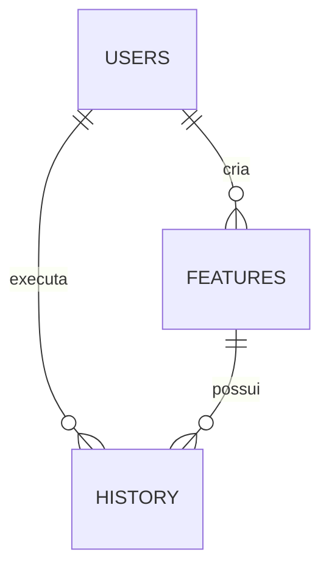
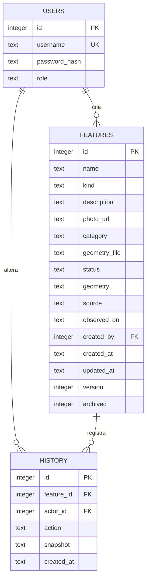

# Modelagem do banco de dados

Data: 03/10/2026. Modelo correspondente à implementação atual. O DDL executável está em [inventario/schema.sql](../inventario/schema.sql).

## Modelo conceitual

O inventário contém **usuários**, **registros ambientais** e **eventos de histórico**. Cada registro representa uma trilha ou uma nascente, tem um usuário criador e pode receber alterações feitas por usuários autorizados. Cada evento pertence a um registro e identifica seu autor.

Um usuário pode criar zero ou vários registros e executar zero ou várias alterações. Cada registro tem exatamente um criador. Cada evento tem exatamente um registro e um autor. O banco permite um registro sem histórico; a aplicação cria o primeiro evento junto com o cadastro.

Trilha e nascente compartilham nome, descrição, origem, data, situação e autoria. Por isso são especializações de uma entidade comum, diferenciadas por `kind`. Nascente exige `Point`; trilha exige `LineString` ou `MultiLineString`. Essa associação é validada no servidor.

## Modelo lógico

## Dicionário de dados

| Entidade/campo | Significado e regra |
| --- | --- |
| `users.id` | Identificador interno, chave primária |
| `users.username` | Nome de acesso obrigatório e único |
| `users.password_hash` | Hash da senha; a senha original não é armazenada |
| `users.role` | `gestor`, `editor` ou `leitor` |
| `features.id` | Identificador interno do registro |
| `features.name` | Nome obrigatório, de 3 a 120 caracteres |
| `features.kind` | `trilha` ou `nascente` |
| `features.description` | Descrição; máximo de 4.000 caracteres validado pela aplicação |
| `features.photo_url` | Link HTTPS opcional, até 2.048 caracteres; não é um arquivo de foto |
| `features.category` | Classificação de uso opcional, até 120 caracteres |
| `features.geometry_file` | Nome sanitizado do arquivo importado, até 250 caracteres; não guarda o XML |
| `features.status` | `a_verificar`, `conservado` ou `atencao` |
| `features.geometry` | Geometria GeoJSON em texto, validada pela aplicação |
| `features.source` | Origem do levantamento obrigatória, até 250 caracteres |
| `features.observed_on` | Data do levantamento, ISO `AAAA-MM-DD`; não pode ser futura |
| `features.created_by` | Chave estrangeira para o usuário criador |
| `features.created_at` / `updated_at` | Horários em UTC, definidos pelo servidor |
| `features.version` | Versão iniciada em 1 e incrementada nas alterações |
| `features.archived` | 0 para ativo, 1 para arquivado |
| `history.id` | Identificador do evento |
| `history.feature_id` | Chave estrangeira para o registro |
| `history.actor_id` | Chave estrangeira para o autor da operação |
| `history.action` | Operação registrada pela aplicação; não possui enumeração CHECK no banco |
| `history.snapshot` | Cópia completa do estado após a operação, em JSON |
| `history.created_at` | Horário UTC do evento |

Campos opcionais textuais de `features` usam string vazia como padrão e são `NOT NULL`. A extensão `length_m` é calculada a partir da geometria e não é uma coluna persistida.

## Modelo físico e integridade

Banco: `instance/inventario.sqlite3`, salvo em disco local no desenvolvimento. Em nuvem, usar o caminho configurado em armazenamento persistente. O esquema usa tabelas relacionais, chaves primárias inteiras, chaves estrangeiras e restrições `NOT NULL`, `UNIQUE` e `CHECK`.

| Regra | Local de implementação |
| --- | --- |
| Usuário único | `UNIQUE(users.username)` |
| Perfis, tipos, situações e indicador de arquivamento válidos | `CHECK` no DDL |
| Nome entre 3 e 120 caracteres | `CHECK` no DDL e validação da aplicação |
| Criador, autor e registro existentes | Chaves estrangeiras; `PRAGMA foreign_keys = ON` em cada conexão |
| Coordenadas finitas e dentro dos limites; geometria compatível com o tipo | Aplicação |
| Data válida e não futura, link HTTPS e limites dos textos | Aplicação |
| Alteração sem sobrescrever uma versão mais recente | Aplicação e atualização condicionada à versão |
| Registro e histórico gravados juntos | Transação da aplicação |

Existe o índice `features_kind_status(kind, status, archived)`, destinado às consultas por tipo, situação e arquivamento. Ele não acelera necessariamente buscas textuais com `LIKE` nem todas as combinações de filtros; sua adequação deve ser medida com dados representativos. Não existe índice espacial nesta versão.

O SQL completo em [schema.sql](../inventario/schema.sql) é a fonte física de referência. As verificações de JSON, datas e limites adicionais não devem ser atribuídas ao DDL: inserções diretas por ferramentas externas podem contorná-las.

## Decisões de modelagem

- **Uma tabela de registros:** evita duplicar atributos e mantém listagem, autorização e histórico comuns. Caso surjam atributos próprios numerosos de trilhas e nascentes, avaliar tabelas de especialização.
- **Geometria em GeoJSON:** conserva segmentos e facilita integração com o mapa e exportação. Para consultas espaciais intensivas, avaliar armazenamento geográfico nativo em uma evolução.
- **Histórico com snapshot:** duplicação intencional para preservar o estado de cada versão. A estrutura operacional separa usuários, registros e eventos, mas não se deve afirmar que os documentos JSON são integralmente normalizados.
- **Fotos por link:** reproduz o desenho compartilhado sem inventar um repositório de arquivos. Múltiplas fotos com metadados próprios exigiriam uma entidade adicional.
- **Arquivamento e exclusão:** arquivar preserva o registro e seu histórico. Excluir permanentemente remove ambos, na mesma transação, após conferir a versão. Não há auditoria permanente da exclusão no banco atual.
- **Monitoramento:** situação e histórico representam a evolução cadastral. Observações independentes, medições e séries temporais ainda não têm entidades próprias.

## Início e evolução

O esquema e a primeira implementação já existem. Para iniciar no VS Code, seguir o [plano de início da próxima etapa](PLANO_INICIO_DESENVOLVIMENTO.md). `init-db` cria as tabelas ausentes, sem apagar as existentes. O mecanismo atual acrescenta os campos introduzidos pelo Figma com backup prévio; não constitui um sistema completo de migrações.

Antes de ampliar o modelo: validar novos dados com a comunidade, preparar migração versionada, testar em cópia do banco e demonstrar recuperação do backup. Não inserir coordenadas fictícias como se fossem levantamentos reais.
