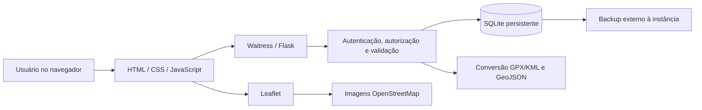

# Stack tecnológica e fundamentação técnica

Data: 03/10/2026. Projeto: Inventário Digital da REBIO do Alto da Serra de Paranapiacaba.

## Decisão

Consolidar a implementação existente em Python 3.12, Flask, HTML/Jinja, CSS, JavaScript, Leaflet e SQLite. Utilizar Waitress para servir a aplicação e Docker como opção de empacotamento para a futura implantação em nuvem. A implantação ainda não foi realizada.

Esta decisão corresponde ao piloto de inventário solicitado pela comunidade. Não pressupõe acesso turístico, dados ambientais reais disponíveis ou necessidade atual de processamento geográfico avançado.

## Fundamentação nos materiais compartilhados

| Evidência local | Necessidade identificada | Decisão técnica |
| --- | --- | --- |
| Plano de Ação 2 e contexto do grupo: cadastro e visualização de trilhas e nascentes | Organizar informações territoriais em uma aplicação acessível pelo navegador | Flask, API HTTP e interface web |
| Contexto do grupo: risco de perda de arquivos e necessidade de organização | Persistência, rastreabilidade e recuperação | Banco relacional, histórico transacional e plano de backup |
| Material de apresentação do PI: framework web, banco, JavaScript, API e nuvem | Demonstrar integração das tecnologias exigidas | Flask + SQLite + JavaScript; implantação planejada com Waitress/Docker |
| Seis imagens do Figma adicionadas à pasta de dados | Reproduzir login, lista/mapa, cadastro, edição, detalhes e exclusão | HTML/Jinja, CSS e JavaScript sem framework adicional |
| Material de acessibilidade e prototipação | Controles identificáveis e alternativa textual ao mapa | HTML semântico, rótulos, foco e lista de registros; avaliação manual ainda pendente |
| Especificação funcional reversa | Autenticação, perfis, validação, importação, exportação e concorrência | Sessões, autorização no servidor, GeoJSON, defusedxml e controle de versão |

Fontes locais: `Dados do PI_II/Grupo - Contexto.txt`, `Dados do PI_II/Referencias.txt`, Plano de Ação 2, materiais das quinzenas e imagens em `Dados do PI_II/figma_extraido`. A [análise das fontes](ANALISE_E_PLANO_MVP.md) registra o contexto; a [especificação reversa](ESPECIFICACAO_FUNCIONAL_REVERSA.md) descreve a versão atual. As capturas do Figma não substituem a validação dos RF/RNF completos com a comunidade.

## Componentes escolhidos

| Camada | Tecnologia | Fundamentação e limite |
| --- | --- | --- |
| Linguagem do servidor | Python 3.12 | Ambiente já preparado, integração direta com SQLite e processamento de arquivos geográficos |
| Framework web | Flask 3.1.3 | Núcleo pequeno e extensível, adequado à API e à aplicação atual; organização por fábrica de aplicação |
| Interface | HTML/Jinja, CSS e JavaScript | Implementação já aderente às telas fornecidas, sem adicionar uma segunda aplicação de frontend |
| Mapa | Leaflet 1.9.4 | Exibição de pontos, linhas, popups e camadas GeoJSON |
| Mapa base | OpenStreetMap | Fonte externa de imagens do mapa; depende de internet e cumprimento da política de uso |
| Persistência | SQLite, módulo `sqlite3` | Banco embarcado que simplifica instalação e piloto; SQL parametrizado e chaves estrangeiras ativadas |
| Intercâmbio geográfico | GeoJSON; entrada GPX/KML | Formato comum entre API, mapa e exportação; XML importado é convertido e descartado |
| Leitura segura de XML | defusedxml 0.7.1 | Restrição de DTD, entidades e referências externas na importação |
| Servidor WSGI | Waitress 3.0.2 | Execução da aplicação em Windows e Linux; servidor de desenvolvimento reservado ao uso local |
| Empacotamento | Docker, imagem Python 3.12 slim | Dockerfile disponível; banco deve ficar em volume persistente |
| Verificação | unittest e verificação de interface com Playwright | Testes existentes usam dados fictícios e bancos temporários |
| Ambiente de trabalho | VS Code, `.venv` e Git | Execução local já documentada; repositório inicializado, mas commits e remoto ainda precisam ser organizados |

As versões das dependências Python estão fixadas em [requirements.txt](../requirements.txt). Flask não impõe uma camada de banco, o que permite o acesso explícito por `sqlite3`; isso também significa que uma troca de banco exige adaptação do código. Referência: [projeto do Flask](https://flask.palletsprojects.com/en/stable/design/).

SQLite é adequado ao piloto com uma instância da aplicação e volume local persistente. A própria documentação distingue esse cenário de aplicações com muitos escritores concorrentes ou necessidade de banco servido pela rede. Referência: [quando usar SQLite](https://www.sqlite.org/whentouse.html).

Waitress oferece execução WSGI em Windows, compatível com o ambiente de desenvolvimento do grupo. Referência: [Waitress na documentação Flask](https://flask.palletsprojects.com/en/stable/deploying/waitress/). Os recursos de mapa utilizados estão descritos na [referência oficial do Leaflet](https://leafletjs.com/reference.html).

## Arquitetura

O navegador não acessa o banco diretamente. As regras de perfil, validação e autoria ficam no servidor. Alteração do registro e gravação do histórico compartilham uma transação. Imagens externas e biblioteca do mapa não são armazenadas no banco. O backup externo é uma obrigação operacional prevista, ainda não automatizada.

## Alternativas e critérios de evolução

- **Django:** alternativa para uma evolução que demande administração integrada e maior estrutura. A versão atual já possui API, autenticação e telas específicas em Flask; não há requisito compartilhado que justifique reescrever essa base agora.
- **React/Vue:** avaliar se a interface crescer a ponto de exigir gerenciamento complexo de estado. As seis telas atuais são atendidas pelo frontend existente.
- **PostgreSQL/PostGIS:** avaliar quando houver múltiplas instâncias, muitos escritores simultâneos ou consultas espaciais como proximidade e interseção. Não está implementado. A migração exigirá converter esquema, SQL, transações e geometrias; não basta alterar uma variável de conexão.

Não selecionar provedor de nuvem nesta etapa sem conhecer orçamento, manutenção e condições de acesso. Para SQLite, exigir uma única instância com disco persistente, HTTPS, segredo de sessão configurado e backup recuperável. Uma plataforma com disco efêmero não atende à persistência necessária.

## Condições para entrega

1. Validar os RF/RNF completos e a modelagem com a comunidade.
2. Registrar commits e configurar o repositório compartilhado sem senhas, banco ou dados pessoais.
3. Executar o roteiro de testes e a avaliação manual de acessibilidade.
4. Implantar em nuvem e verificar persistência após reinício.
5. Realizar e documentar uma restauração de backup.

Esta stack é uma proposta fundamentada no contexto e na implementação existente; a aprovação pela comunidade e a implantação permanecem etapas distintas.
